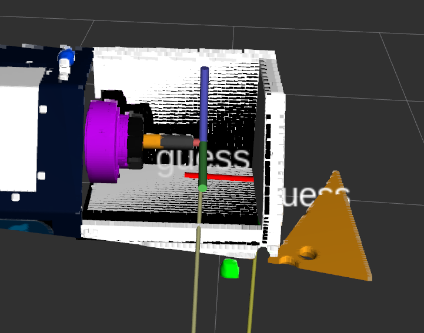

# FetchIt Challenge Generic ICP Pipeline

This repository contains the pipeline to perform model matching via ICP.

## Install
0. Verify that `fetchit_icp` is part of the `derail-fetchit` repo inside the `src` folder
of your `active` workspace.
1. Use `catkin build` to compile the `fetchit_icp` into executables.
2. Source your `devel/setup.bash` file in the `active` workspace.

## Launch Schunk Pose Detection Demo
0. Launch a simulation of fetch or start the physical robot.
1. Localize the robot in the environment using the `task_executor` via `roslaunch task_executor fetchit.launch navigation:=true [sim:=true]`
2. Start the demo by running `roslaunch fetchit_icp template_match_demo.launch`. This should
launch a version of the generic template matching node (i.e. `template_matcher_node`) specific to detecting the schunk along with a general ICP matching node (i.e. `icp_matcher_node`) automatically.
3. Drive the robot and move the head so it can view the corner of the schunk machine and the chuck in its point cloud as shown below:

4. Verify that the `initial_estimate` frame in tf is near the corner of the schunk machine. This initial guess is used to initialize the `template_matcher_node` for ICP. If the `initial_estimate` is off by more than 0.1 m and/or 20 degrees along each axis, ICP might not find a registation between the template and viewing point cloud. If the estimate is too far, adjust it in the launch file (i.e. adjust variable `initial_estimate` inside `template_match_demo.launch`). This can also be done faster using `static_transform_publisher` directly.
5. Once the robot is localized, the schunk is properly in the robot's point cloud, and the schunk `initial_estimate` is properly set, make a service call to detect the chuck via `rosservice call /match_template`. An estimated chuck approach frame named `template_pose` should appear in tf.
6. Additionally, if visualizations are enabled, you can view the target, template, and matched template point clouds in rviz by subscribing to `target_points`, `template_points`, `matched_template_points`, respectively.

## Coordinate Frame Convention for Schunk Machine
1. I have made the x-axis align with the chuck slot and z-axis
vertical as shown in the image above from simulation.

## Matching to other templates (bin, handle, etc.)
1. To do this, simply create another launch similar to the `template_match_demo.launch` which is currently set up specifically for the schunk machine. The main changes will be updating `initial_estimate`, `template_offset`, and `template_filename`.

## To Dos
- Test on physical robot
- Add as action to task_executor
- Add task to make robot look at schunk machine then detect the chuck
