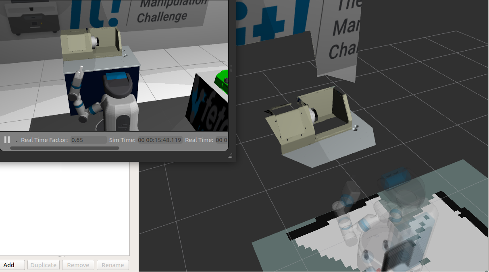
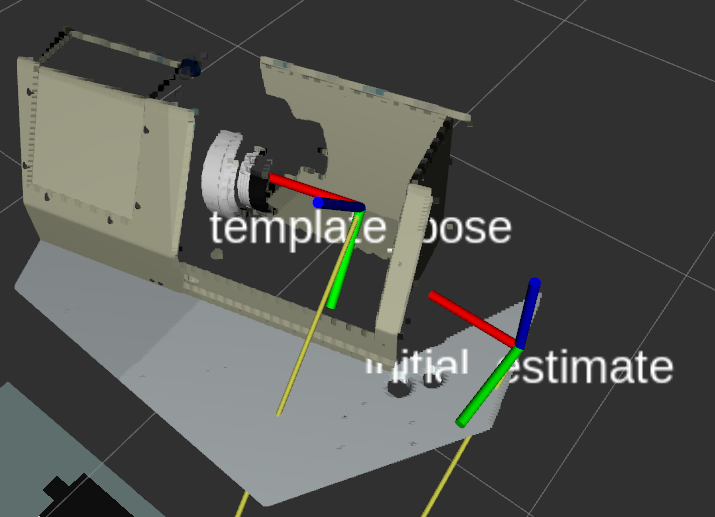

# rail_mesh_icp

This repository contains the pipeline to perform model matching via ICP.

## Install
0. Clone the `rail_mesh_icp` package into your ROS workspace
1. Use `catkin build` to compile the `rail_mesh_icp` into executables.
2. Source your `devel/setup.bash` file in the workspace.

## Background
 The mesh models are first converted to point clouds using a mesh sampling tool, then the
model (source) point cloud is matched to a target point cloud using PCL's Iterative Closest Point (ICP) class template 
[pcl::IterativeClosestPoint](http://docs.pointclouds.org/trunk/classpcl_1_1_iterative_closest_point.html) and an estimate
of the objects 6-DoF pose. This 6-DoF pose estimate can come from an external detector via service calls for dynamic 
objects or predefined in a launch file for static objects. The target point clouds can either be raw point cloud from a 
[sensor_msgs/PointCloud2](http://docs.ros.org/melodic/api/sensor_msgs/html/msg/PointCloud2.html) topic or preprocessed 
point clouds included in the service calls. Parameters  

## Make the Mesh (Source) Cloud
0. After you have mesh model for your object, convert it to a PLY (i.e. `.ply`) file format so the mesh sampling tool 
can read the file format and convert it to a point cloud. In Ubuntu, [Mesh Lab](http://meshlab.sourceforge.net) allows 
you to import many mesh model formats (e.g. STL, PLY, DAE) and convert them to PLY via the `Import Mesh` and 
`Export Mesh` options.
1. With the mesh model in PLY format, you can call the mesh sampling tool via `rosrun rail_mesh_icp mesh_sampler_node 
[INPUT_MESH_MODEL].ply [OUTPUT_POINT_CLOUD].pcd`. Optional arguments, like sampling density, are detailed using `-h`.
2. If the sampling tool was successful, there should now be a `.pcd` file in the `cad_models` folder.

## Matching the Source Cloud to the Target Cloud
0. The source cloud can be matched to the target cloud (i.e. a point cloud topic) provided the initial pose estimate.
The initial pose estimate is provided as a 6-DoF transform via launch file or service call argument `initial_estimate`
depending on the use case.
1. An example launch file to match the `corner.pcd` template to a static environment object is 
`template_match_demo.launch`. It's intended use is with the 
[Fetchit Challenge](https://github.com/fetchrobotics/fetch_gazebo/tree/gazebo9/fetchit_challenge) environment. Please 
follow tutorials found [here](http://docs.fetchrobotics.com/gazebo.html) to install the environment and robot simulator. 

## Pose Detection Demo
0. Launch a simulation of the fetch and simulation environment using `roslaunch fetchit_challenge main.launch`.
1. Launch the navigation stack to enable localization via `roslaunch fetch_navigation build_map.launch`.
2. AFTER launching navigation, teleop the Fetch to face the front corver of the large recangular machine using keyboard
teleop via `rosrun teleop_twist_keyboard teleop_twist_keyboard.py` making sure the Fetch's published point cloud under 
topic `/head_camera/depth_registered/points` clearly captures the corner of the machine as shown below:

2. Start the template matching and icp nodes using the demo launch file via 
`roslaunch rail_mesh_icp template_match_demo.launch`. This should launch a version of the generic template matching 
node (i.e. `template_matcher_node`) specific to matching the `corner` template along with an ICP matching node 
(i.e. `icp_matcher_node`) automatically.
4. Verify that the new `initial_estimate` frame in tf is near the corner of the schunk machine. This initial guess is 
used to initialize the `template_matcher_node` for ICP. If the `initial_estimate` is off by more than 0.1 m and/or 20 
degrees along each axis, ICP might not find a registration between the template and viewing point cloud. If the 
estimate is too far, adjust it in the launch file (i.e. adjust variable `initial_estimate` inside 
`template_match_demo.launch`). This can also be done faster using `static_transform_publisher` directly.
5. A service call to detect the corner via `rosservice call /template_matcher_demo_node/match_template` will start the 
template matching. Once matched, an estimated frame named `template_pose` should appear in tf with the x-axis aligned 
to the center of the cylindrical part of the machine as shown below: 

This `template pose` can be changed arbitrarily with respect to the 
matched template using the `template_offset` launch argument.
6. Additionally, `debug` is enabled, you can view the target, template, and matched template point clouds 
in rviz by subscribing to `target_points`, `template_points`, `matched_template_points`, respectively.

## Matching to other templates (bin, handle, etc.)
0. To do this, simply create another launch similar to the `template_match_demo.launch` which is currently set up 
specifically for the machine matched in the demo. The main changes will be updating `initial_estimate`, 
`template_offset`, `provide_processed_cloud`, `latch_initial_estimate`, and  `template_filename`.
1. Note that for moveable objects in the environment, the `initial_estimate` can be given along with each 
`~match_template` service call.
